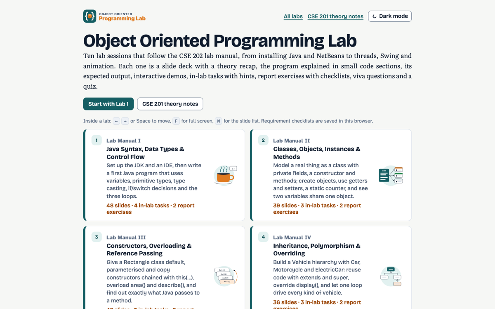
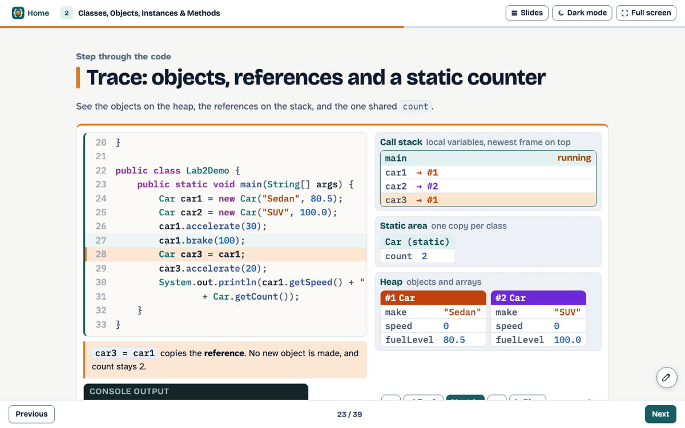
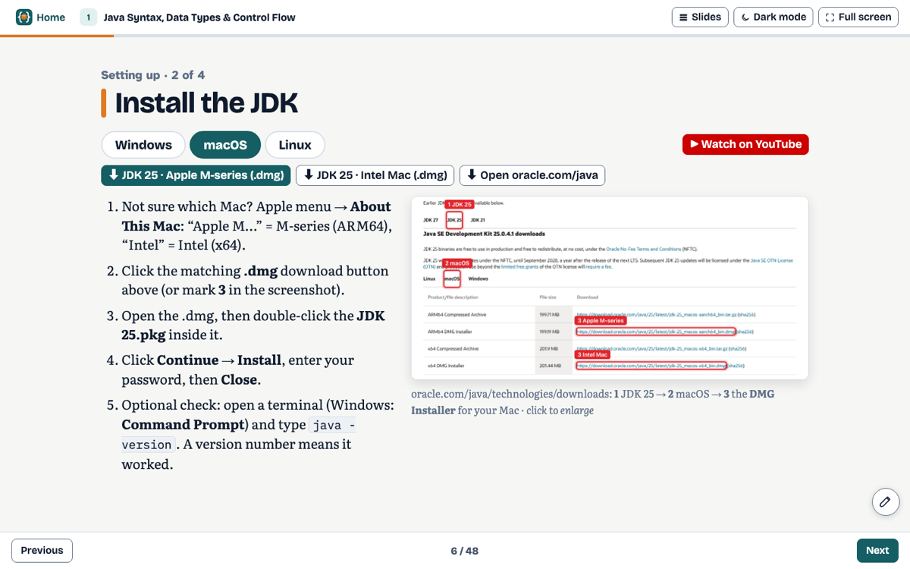

<div align="center">


# CSE 202 · Object Oriented Programming Lab

**Interactive slide decks for the ten Java lab sessions of the CSE 202 lab manual.**

<a href="https://ayan-1829.github.io/CSE-202-Object-Oriented-Programming-Lab/"></a>


### [🌐 Open the live site →](https://ayan-1829.github.io/CSE-202-Object-Oriented-Programming-Lab/)

</div>

<br>

<p align="center">  </p>

<p align="center"><a href="https://ayan-1829.github.io/CSE-201-Object-Oriented-Programming/">CSE 201 theory notes</a></p>

## ✨ Highlights

<table>
<tr><td width="50%" valign="top">🧭&nbsp; Java (JDK 25 from the official oracle.com/java site) and Apache NetBeans setup for Windows, macOS and Linux: direct download links, screenshots marked step by step, and video guides</td><td width="50%" valign="top">🔍&nbsp; Every lab program explained in small code sections, plus <b>step-through traces</b> that show the call stack, heap objects and output line by line</td></tr>
<tr><td width="50%" valign="top">🧩&nbsp; Expected output in a “Run program” console, live demos, and browser versions of the Swing programs</td><td width="50%" valign="top">📝&nbsp; In-lab tasks with hints, report exercises with saved checklists, viva questions and a quiz per lab</td></tr>
</table>

## 📚 Labs

10 decks · 395 slides. Each title opens the live deck.

| # | Lab | Slides |
|:--:|---|:--:|
| **1** | [Java Syntax, Data Types & Control Flow](https://ayan-1829.github.io/CSE-202-Object-Oriented-Programming-Lab/labs/01-java-basics.html) | 49 |
| **2** | [Classes, Objects, Instances & Methods](https://ayan-1829.github.io/CSE-202-Object-Oriented-Programming-Lab/labs/02-classes-and-objects.html) | 40 |
| **3** | [Constructors, Overloading & Reference Passing](https://ayan-1829.github.io/CSE-202-Object-Oriented-Programming-Lab/labs/03-constructors-overloading.html) | 43 |
| **4** | [Inheritance, Polymorphism & Overriding](https://ayan-1829.github.io/CSE-202-Object-Oriented-Programming-Lab/labs/04-inheritance-polymorphism.html) | 37 |
| **5** | [Abstract Classes & Interfaces](https://ayan-1829.github.io/CSE-202-Object-Oriented-Programming-Lab/labs/05-abstract-classes-interfaces.html) | 35 |
| **6** | [Exception Handling & Custom Exceptions](https://ayan-1829.github.io/CSE-202-Object-Oriented-Programming-Lab/labs/06-exception-handling.html) | 39 |
| **7** | [Thread Creation & Thread States](https://ayan-1829.github.io/CSE-202-Object-Oriented-Programming-Lab/labs/07-threads.html) | 35 |
| **8** | [Synchronization, Deadlock & Resource Allocation](https://ayan-1829.github.io/CSE-202-Object-Oriented-Programming-Lab/labs/08-synchronization-deadlock.html) | 37 |
| **9** | [GUI Components, Drawing, AWT & Swing](https://ayan-1829.github.io/CSE-202-Object-Oriented-Programming-Lab/labs/09-gui-swing.html) | 41 |
| **10** | [Animation with Threads](https://ayan-1829.github.io/CSE-202-Object-Oriented-Programming-Lab/labs/10-animation.html) | 39 |

## ⌨️ Using the slides

| Key | Action |
|:--:|---|
| <kbd>←</kbd> <kbd>→</kbd> · <kbd>Space</kbd> | previous / next slide |
| <kbd>Home</kbd> · <kbd>End</kbd> | first / last slide |
| <kbd>F</kbd> | full screen for teaching |
| <kbd>M</kbd> | slide list |
| ✏️ | draw on any slide |

The address bar shows `#s=N`, so you can link straight to a slide. Light and dark themes follow your system, with a toggle in the header.

## 🚀 Run it locally

No build step, no server: clone the repository and open `index.html` in any modern browser.

```bash
git clone https://github.com/Ayan-1829/CSE-202-Object-Oriented-Programming-Lab.git
open CSE-202-Object-Oriented-Programming-Lab/index.html      # macOS · use start on Windows, xdg-open on Linux
```

<details>
<summary><b>🛠 Developer notes: folder layout and how the pages are built</b></summary>

```text
Structure:
  index.html      lab list
  labs/*.html     10 lab decks (←/→, F full screen, M slide list)
  js/lab.js       code viewer, run console, saved checklists, Lab 1 setup guides, browser versions of the Swing programs
  img/setup/      screenshots of the official JDK and NetBeans download pages
  js/lab-traces.js step-through traces of the lab programs (added to TRACES from js/traces.js)
  js/lab-figs.js  lab diagrams (added to the figure registry in js/figs.js)
  css/lab.css     lab-specific styles
  Shared engine copied from the CSE 201 site: css/style.css, js/core, java, figs, quiz, page, slides, annotate, demos-*, art

The pages are generated by tools/build.py (kept next to this folder, not published).
```

</details>

## 🎓 All courses

| | Course | Live site | Repository |
|:--:|---|:--:|:--:|
|  | **CSE 201** · Object Oriented Programming | [Open](https://ayan-1829.github.io/CSE-201-Object-Oriented-Programming/) | [GitHub](https://github.com/Ayan-1829/CSE-201-Object-Oriented-Programming) |
|  | **CSE 202** · Object Oriented Programming Lab **(this one)** | [Open](https://ayan-1829.github.io/CSE-202-Object-Oriented-Programming-Lab/) | [GitHub](https://github.com/Ayan-1829/CSE-202-Object-Oriented-Programming-Lab) |
|  | **CSE 203** · Digital Logic Design | [Open](https://ayan-1829.github.io/CSE-203-Digital-Logic-Design/) | [GitHub](https://github.com/Ayan-1829/CSE-203-Digital-Logic-Design) |
|  | **CSE 308** · Design Project I | [Open](https://ayan-1829.github.io/CSE-308-Design-Project-I/) | [GitHub](https://github.com/Ayan-1829/CSE-308-Design-Project-I) |

---

<p align="center">Made by <b>Ayan Sarkar</b> · Green University of Bangladesh</p>
